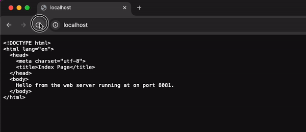
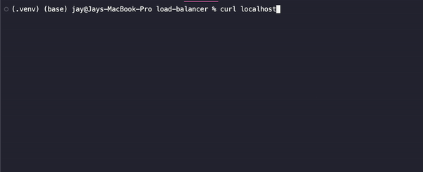

# Building Your Own Load Balancer | Layer 7 

This challenge is to build your own application layer load balancer.

## The Challenge

A load balancer performs the following functions:

* Distributes client requests/network load efficiently across multiple servers
* Ensures high availability and reliability by sending requests only to servers that are online
* Provides the flexibility to add or subtract servers as demand dictates

Therefore our goals for this project are to:

* Build a load balancer that can send traffic to two or more servers.
* Health check the servers.
* Handle a server going offline (failing a health check).
* Handle a server coming back online (passing a health check).

### Currently:

There is a YAML file containing the backend servers on different ports. 

Each port is run like so: 

```bash
python -m http.server (port) --directory (e.g. server8080)
```

Run the load balancer:

```bash
python lb.py
```

It will run on port 80 so may need extra permissions to do so. 

```bash
curl localhost
```

Here is an example of it running through chrome. As you can see it cycles through each of the ports. 




Through the terminal: 



Basic Load balancer implemented! (steps 0 - 2 completed)

Health checks yet to be implemented. (steps 3+)