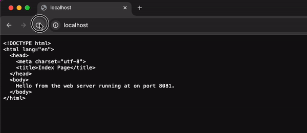
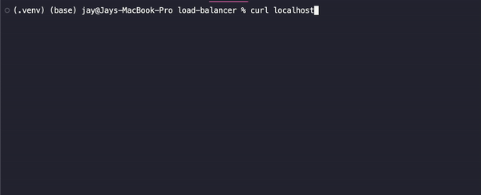
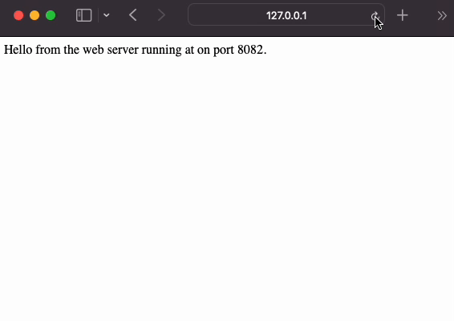
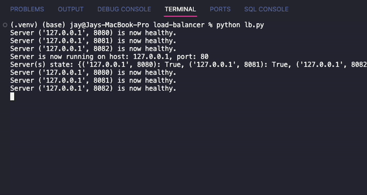
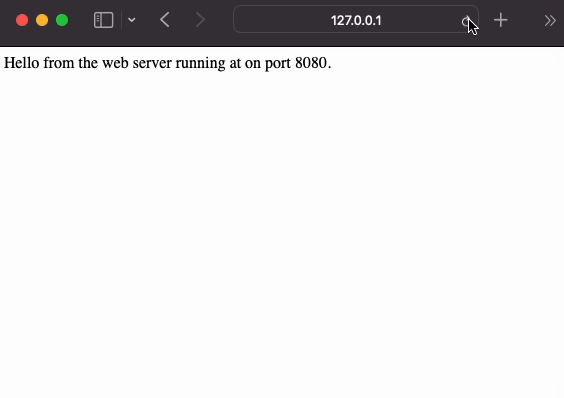
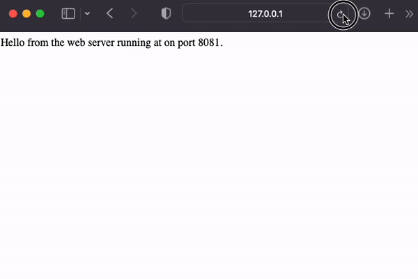

# Building Your Own Load Balancer | Layer 7 

This challenge is to build your own application layer load balancer.

- [Building Your Own Load Balancer | Layer 7](#building-your-own-load-balancer--layer-7)
  - [The Challenge](#the-challenge)
    - [How to run:](#how-to-run)
    - [example](#example)
  - [Adding server health checker.](#adding-server-health-checker)


## The Challenge

A load balancer performs the following functions:

* Distributes client requests/network load efficiently across multiple servers
* Ensures high availability and reliability by sending requests only to servers that are online
* Provides the flexibility to add or subtract servers as demand dictates

Therefore our goals for this project are to:

* Build a load balancer that can send traffic to two or more servers.
* Health check the servers.
* Handle a server going offline (failing a health check).
* Handle a server coming back online (passing a health check).

### How to run:

There is a YAML file containing the backend servers on different ports. 

Each port is run like so: 

```bash
python -m http.server 8080 --directory server8080
```

I am using 3 servers here. ports 8080,8081 and 8082. Later I will close one of them to see how the health checker deals with it. 

Run the load balancer:

```bash
python lb.py
```

It will run on port 80 so may need extra permissions to do so. 

```bash
curl localhost
```

### example 

Here is an example of it running through chrome. As you can see it cycles through each of the ports. 




Through the terminal: 



Basic Load balancer implemented! (steps 0 - 2 completed)

## Adding server health checker. 

A health check will be performed periodically to check the application servers that we're forwarding the traffic to. If any server fails the health check then we will stop sending requests to it. 

Health checker subclasses threading.Thread which allows it to run the 'run' method in a separate thread. The class inherits its functionality for creating and managing threads provided by the threading module. 

The run method is overridden to define the behavior of the thread when it starts running. The class is started in the lb.py file. 

I have used periods of 10 seconds to do the health checks. 

By using threading, multiple health checks can be performed simultaneously without blocking the main thread of execution, allowing other tasks to be performed concurrently. 


  > **All ports online and healthy with requests being sent to them through curl.**


> **Requests shown through the browser, this shows the cyclical nature of the load balancer. Round Robin algo in action!**



> **Closing one of the servers and seeing the response. Server is closed and the state of the server is False/unhealthy.**



> **Having a look at this through the browser, you can see it will skip over port 8081 as it is closed and only send requests to the healthy ports.**



> **Now 8080 and 8081 are healthy servers, with 8082 being down. The server is then started up again and you can see that it starts routing requests again.**




